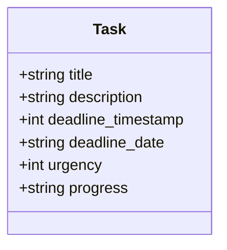
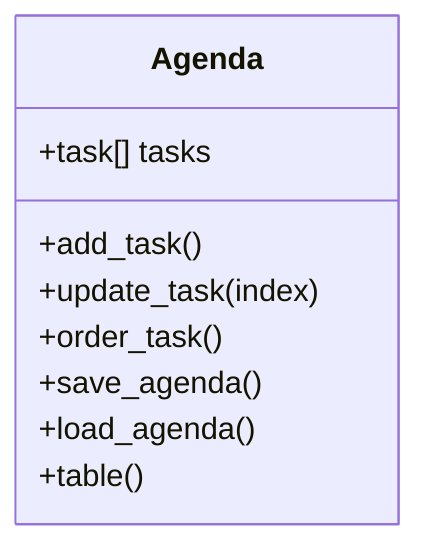

# Task Scheduler

## 1 Introduction

The purpose of this Project is to provide a tool to organise and keep track of a given set of tasks. throughout the following document the Project will be referred to as TS for "Task Scheduler"

## 1.1 Goals

- Users should be able to save and retrieve tasks from a save file
- Users should be able to add, update and view tasks
- Users should be able to have multiple save files
- Users data should be stored in a format that can be used by other software, so that users can retrieve their data should they need to

features:
**features set may change in development, final product may change, add and or remove features where deemed necessary**

- **adding** new entries to the schedule
- **Update** schedule
- **viewing** schedule
- persistence of schedule through save files
- **urgency** value from 1 to 4
- the program will also store the **progress** on each task

## 2 Analysis
**feature requirements**

### 2.1 User input

> - **adding** new entries to the schedule
> - **Update** schedule

Inevitably both of these features will require user input, thus it's necessary to sanitise the input data, as well as wrap them in try&catch statements while they get processed and validated. when said values do turn out to be contaminated the user must be prompted with details on what has happened without overloading them with blocks of technical error messages; it is also critical that when said errors occur the program should still continue running. this all is necessary to avoid the program crashing causing the user distress and unnecessary tinkering with the softwared

### 2.2 Data presentation

> - **viewing** schedule

This will likely mean that later in development there will be the need to present data in a certain orderly format, likely a table, this could require an external data analysis library like **Pandas**, however the table format can be achieved with f-strings and some other standard library functions. another discussion is UI, unfortunately this project is decidedly text based as developing a GUI along side all the other features is not feasible within the time constrains, though it could always be added in future development.


### 2.3 Data Persistence

> - persistence of schedule through save files

The data produced by the user should be saved in a file to be accessed at later date, the file format in question will be CSV (Comma Separated Values), this choice is driven by the open nature of CSV and wide support for it in other software, which means users can retrieve their data without TS if need should arise. To make reading from a CSV file easier a library will be needed, python standard library comes with a CSV library, which will be used to read and write said files.

### 2.4 Data Structure

> - the program will also store the **progress** on each task
> - **urgency** value from 1 to 4

These features as well as previous onces require for a structure to store this data in to be accessed and loaded in at start up, the solution comes in the form of dataclasses, python already comes with dataclasses, again making sure the end user doesn't need to install third party libraries, dataclasses will allow to store and modify the data without getters or setters thus streamlining the development process. The dataclass in question will be the task class, which will store the atomic elements from the save file and other values will be computed on at runtime by class functions as and when necessary

## 3 Design

### 3.1 Saving system

An important factor in user experience is to allow users to view their task even if the TS fails due to say a bug, to achieve this goal the agenda will be saved as CSV file to allow the user to open the agenda file in a moment of panic or hurry in other programs that support the format such as Microsoft Excel. This allows users to maintain control over their data as they do not necessary require TS to access their agenda, providing users with peace of mind and tranquillity.


### 3.2 Task model


- the program will show the user the task in order of urgency based on deadline or 'urgency' parameter which will be set by user for particularly important task

Entries model:

|  id   | task title | Description or any notes |   deadline    | urgency | progress  |
| :---: | :--------: | :----------------------: | :-----------: | :-----: | :-------: |
|  #1   | groceries  |  make sure to get milk   | 21st November |    1    | on my way |

The task will be saved in a CSV file in much the same manner:

```csv
id; task title; notes; deadline; urgency; progress;
#1; groceries; make sure to get milk; 21st November; 1; on my way
```
the class structure of this could be as follows:



### 3.3 Menu


The command line menu will be as follows:

```code
options:

		0: Quit
		1: View tasks
		2: Add new entry to the schedule
		3: Update entry
```

if options is:

- 0

	- the program will save and close the current schedule file
	- the program will then close

- 1

	- the program will display the current tasks as follows

		```code
		current tasks:

		| id | task title | Description or any notes | deadline | urgency | progress|
		| #1 | groceries | make sure to get milk | 21st November | 1 | on my way |
		```

	- the output format is likely to change

	- back to the menu

- 2

	- the user will be prompted to enter task name, notes, deadline and an urgency level
	- the data will be saved to the CSV file
	- back to the menu

- 3

	- the user will be prompted with the current task using code from option 1
	- the user will chose the ID of the task to change or update
	- the user will be prompted with each property of the entry if left empty the property will not be changed
	- once the user has updated the entry all the data will be saved in the CSV file
	- back to the menu

The menu option processing can be expressed in the following **Pseudocode**

```python
if option == 0:
	save_agenda()
	close()
	# save the agenda with tasks and exit program

elif option == 1:
	if tasks != empty:
		Tasks.table()
	else:
		output("no tasks to view")
	# check if there are tasks, if yes then print or else prompt the user of it

elif option == 2:
	Agenda.add_task()
	# add task by calling function

elif option == 3:
	if tasks != empty:
		Tasks.table()
		output("please select task index to update")
		Agenda.update(index_of_task)
		# check if there are any tasks before updating any
	else:
		output("no task to update")
else:
	output("option {option} is not available, please chose from the available menu")
	# if the user choose an option not implemented prompt them
```

this should be in the main loop.

When getting user input there needs to be input sanitisation and type checking, a prototype might be as follows:

```python
try:
	option = input(
	"option:"
	"0: Quit"
	"1: View tasks"
	"2: Add new entry to the schedule"
	"3: Update entry")
	option = int(option)
	# get user input and try to check if it's an integer
	# if not
except:
	# input is empty
	if not option:
		output("Please select one of the options")
	# input is not integer
	else:
		output("Please select an integer option")

```


### 3.4 Smart Urgency

As tasks have a deadlines and urgency values there is a need for combining the two into a single value by which to sort all tasks in a sense of order. In practice the smart_urgency would be calculated as such:

$Smart Urgency = urgency * (deadline / CurrentTime)$

though this is a rudimental formula it does the job for the time being. the basic idea is to get the time remaining as a decimal percentage and then multiple it by the urgency value. Though this formula gives much more focus to urgency values as in practice the urgency value can overwrite the importance of the deadline, but it's important to remember this is not a final product it could change before the final product or even in future development, even in the eventuality that this is the final formula the end user will likely take care in reading the tasks and setting their own value judgement to the importance of each task

### 3.5 Agenda

The Agenda class will be a singleton class containing a list of task objects, this class will handle most of the logic related to the tasks



The agenda class will user load_agenda() when initialised to load the agenda without user input. The agenda class will also use table() to print the current tasks with it's properties that are relevant to the user.

the following is a table **pseudocode** prototype:

```python
def table():
	output(headers)
	for i in tasks:
		output(i.properties)
```

In order to display the tasks we need the them to be in the right order, to do with we have order_tasks() which will use **smart_urgency** as it's value to sort the list of tasks by, the following is prototype **pseudocode** for order_tasks():

```python
def order_tasks():
	tasks.smart_urgency_calc() # update the smart_urgency value before ordering
	tasks = sorted(sort_key="smart_urgency")
```

The sorted() function will be the python inbuilt sorting function, as reimplementing what already exist is a futile waste of time.

## 4 Testing

| test no | title    | description  | result | action |
| :-----: | ---- | ----------- | --- | --------- |
|    1    | no input | some features rely on user input, however if for whatever reason no input was given and this was not account for the program would crash | 2 crashes,<br> the crashes in question have to do with the option 3, when selecting task option or whether to update the deadline | added try&catch for these cases |
| 2 | no agenda | the agenda.csv file which contain the tasks will be removed and the program should detect it missing and prompt the user that it will create a new agenda.csv file | 0 crash,<br> pass | no action needed |
| 3 | update deadline | when deadline is updated the smart urgency value should be computed and the task list should be reordered accordingly, this should show in option 1 (task view) | 0 crashes,<br> pass, behaves as expected and designed | no action needed |
| 4 | inexistent menu option | users may type an inexistent menu option possibly not even integer option the program should worn the user of it and continue running | 0 crashes,<br> pass, behaves as expected and designed | no action needed |
| 5 | wrong data type | enter wrong types in the creation of tasks, the program should default to safe values and inform the user of these errors | 1 crashes, <br> when entering urgency value the wrong type cases an error that escapes the already present try catch in that block due to new error type | this has been fixed by catching all errors |
| 6 | save data | can the program save user data when closing properly? | 0 crashes,<br> pass, behaves as expected and designed | no action needed |
| 7 | save data on crash | if we crash the program forcefully will it save user data? | 1 crash (obviously), <br> the program does not save data when it crashes as it was not designed for this eventuality | no action was taken, however possible solutions will be discussed |
| 8 | loading data | will the program properly load saved data? | 0 crashes,<br> pass, behaves as expected and designed | no action needed |
| 9 | creating task | create a task with valid values | 0 crashes, <br> pass, behaves as expected abd designed | no action needed |
| 10 | update task | update existing task | 0 crashes, <br> pass, behaves as expected abd designed | no action needed |
| 11 | create task, save, re-load, update | create a valid task, close program properly, re-load and update that task  to check it all works in conjunction | 0 crashes, <br> pass, behaves as expected abd designed | no action needed |

The program has achieved the following goals:
- [x] Users should be able to save and retrieve tasks from a save file
- [x] Users should be able to add, update and view tasks
- [ ] Users should be able to have multiple save files
  - can be done manually by the users
- [x] Users data should be stored in a format that can be used by other software, so that users can retrieve their data should they need to

The program has implemented the following features:

- [x] **adding** new entries to the schedule
- [x] **Update** schedule
- [x] **viewing** schedule
- [x] persistence of schedule through save files
- [x] **urgency** value from 1 to 4
- [x] the program will also store the **progress** on each task

**Extra features**
- [x] smart urgency
- [x] atomic save files

## 5 Critique

### 5.1 Smart Urgency

The smart urgency formula is still not perfect, it can often give precedence to tasks that should not get so, as well as the fact that the urgency value itself is quantitatively vague. The system produces fairly large floating point numbers under the hood when it simply dose not need, though it dose the job it waste significant chunks of memory even at the current scale.

It also dose not account for overdue tasks which will have negative values and thus will be placed at the bottom of the table, whereas one would argue negative smart urgency values should be given priority

### 5.2 Viewing tasks

Though the current task view table is functional for tasks with fairly short title and description, however if the title description was to increase that will offset the rest of the fields. there is also to consider the deadline date which also covers a significant portion of the display with 0s, there would be the option to simply hide the hour part but that is but a band-aid fix for a larger design flaw, although this could be overcome with external libraries such a **Pandas** that were designed with such contingencies in mind


### 5.3 Saving files

Only critical data is saved to save disk space, data such as smart urgency or actual deadline date are calculated at runtime and not saved. the format allows user to view the raw data with any text editor.

However if TS crashes any changes will not be saved (refer to test 7) as saves are also done on proper exits, this could be resolved with caches or saving after each change, this methods can be implemented fairly simply in the future

### 5.4 Menu

The text based menu allows easily add new menu options without messing with UI components as well as not requiring external libraries.

The text based interface is quite unapproachable for non developer users who might be deterred by the terminal window or simply confused, for future development a GUI would likely improve user experience significantly
